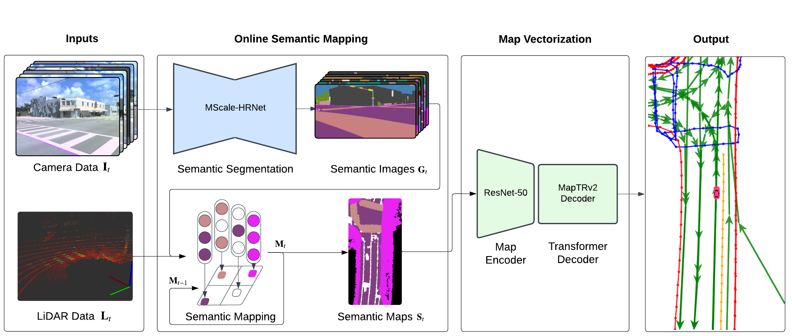

<div align="center">
<h1>SemVecNet</h1>
<h3>Generalizable Vector Map Generation for Arbitrary Sensor Configurations</h3>

Narayanan Elavathur Ranganatha\*, Hengyuan Zhang\*, Shashank Venkatramani, Jing-Yan Liao and Henrik I. Christensen
 
Contextual Robotics Institute, University of California San Diego

(\*) equal contribution

ArXiv Preprint ([arXiv 2405.00250](https://arxiv.org/abs/2405.00250))

</div>

## Introduction
<div align="center"><h4>SemVecNet is a online vectorized HD map construction framework that uses intermediate semantic maps for sensor-configuration generalizarion.</h4></div>



Vector maps are essential in autonomous driving for tasks like localization and planning, yet their creation and maintenance are notably costly. While recent advances in online vector map generation for autonomous vehicles are promising, current models lack adaptability to different sensor configurations. They tend to overfit to specific sensor poses, leading to decreased performance and higher retraining costs. This limitation hampers their practical use in real-world applications. In response to this challenge, we propose a modular pipeline for vector map generation with improved generalization to sensor configurations. The pipeline leverages probabilistic semantic mapping to generate a bird's-eye-view (BEV) semantic map as an intermediate representation. This intermediate representation is then converted to a vector map using the MapTRv2 decoder. By adopting a BEV semantic map robust to different sensor configurations, our proposed approach significantly improves the generalization performance. We evaluate the model on datasets with sensor configurations not used during training. Our evaluation sets include larger public datasets, and smaller scale private data collected on our platform. Our model generalizes significantly better than the state-of-the-art methods.

## Models

| Model | Train dataset | Test dataset | mAP| mAP ratio(%)|
| :---: | :---: | :---: | :---: | :---: 
| SemVecNet | AV2 | NuScenes | 12.2| |
| | AV2 | AV2 | 49.0| 24.8|
| MapTRv2 | AV2 | NuScenes | 0.0| |
| | AV2 | AV2 | 67.4| 0.0|
| SemVecNet | NuScenes | AV2 | 16.2| |
| | AV2 | AV2 | 49.0| 33.1|
| SemVecNet | AV2 | NuScenes | 0.0| |
| | AV2 | AV2 | 61.5| 24.8|

## Getting Started
- [Installation](docs/install.md)
- [Prepare Dataset](docs/prepare_dataset.md)
- [Train and Eval](docs/train_eval.md)


## Acknowledgements

SemVecNet is heavily based on [MapTRv2](https://github.com/hustvl/MapTR/tree/maptrv2) which is based on [mmdetection3d](https://github.com/open-mmlab/mmdetection3d). It is also greatly inspired by the following outstanding contributions to the open-source community: [BEVFusion](https://github.com/mit-han-lab/bevfusion), [BEVFormer](https://github.com/fundamentalvision/BEVFormer), [HDMapNet](https://github.com/Tsinghua-MARS-Lab/HDMapNet), [GKT](https://github.com/hustvl/GKT), [VectorMapNet](https://github.com/Mrmoore98/VectorMapNet_code).

## Citation
If you find SemVecNet is useful in your research or applications, please consider giving us a star 🌟 and citing it by the following BibTeX entry.
```bibtex
@INPROCEEDINGS{10588555,
  author={Ranganatha, Narayanan Elavathur and Zhang, Hengyuan and Venkatramani, Shashank and Liao, Jing-Yan and Christensen, Henrik I.},
  booktitle={2024 IEEE Intelligent Vehicles Symposium (IV)}, 
  title={SemVecNet: Generalizable Vector Map Generation for Arbitrary Sensor Configurations}, 
  year={2024},
  volume={},
  number={},
  pages={2820-2827},
  keywords={Training;Semantic segmentation;Pipelines;Semantics;Probabilistic logic;Vectors;Planning},
  doi={10.1109/IV55156.2024.10588555}}

```

Please also cite MapTRv2 if you cite our work

```bibtex
@inproceedings{MapTRv2,
  title={MapTRv2: An End-to-End Framework for Online Vectorized HD Map Construction},
  author={Liao, Bencheng and Chen, Shaoyu and Zhang, Yunchi and Jiang, Bo and Zhang, Qian and Liu, Wenyu and Huang, Chang and Wang, Xinggang},
  booktitle={arXiv preprint arXiv: 2308.05736},
  year={2023}
}
```